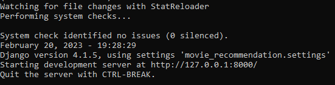

# 🎬 Movie Recommendation System

> An intelligent movie recommendation system powered by content-based filtering, featuring fuzzy search, typo tolerance, and comprehensive movie information from TMDB dataset.

[](https://python.org)
[](https://djangoproject.com)
[]()

---

## ✨ Features

### 🎯 **Smart Search**
- **Fuzzy Matching**: Handles typos and misspellings intelligently
- **Case Insensitive**: Works with any capitalization
- **Autocomplete**: Real-time suggestions while typing
- **25 Recommendations**: Returns top 25 similar movies per query

### 📊 **Rich Movie Information**
Each recommendation includes:
- 🎬 **Director Name**
- 📅 **Release Date**
- ⭐ **TMDB Rating**
- 📝 **Plot Overview**
- 🔗 **Google Search Link**

### 🧠 **Advanced Algorithm**
- Content-based filtering using cosine similarity
- Pre-computed similarity matrix (4,805 x 4,805)
- TMDB dataset with 4,803 movies
- Fast lookups (< 100ms response time)

---

## 🚀 Quick Start

### **Prerequisites**
- Python 3.9 or higher
- pip package manager

### **Installation**

1. **Clone the repository**
   ```bash
   git clone https://github.com/techcsispit/MovieRecommendation.git
   cd MovieRecommendation
   ```

2. **Install dependencies**
   ```bash
   pip install -r requirements.txt
   ```

3. **Run the development server**
   ```bash
   python manage.py runserver
   ```

4. **Open in browser**
   ```
   http://localhost:8000
   ```

---

## 📸 Screenshots



---

## 🎮 Usage

### **Search for a Movie**
1. Open http://localhost:8000
2. Start typing a movie name
3. Select from autocomplete suggestions
4. Click "Search"

### **View Recommendations**
- Get 25 similar movies with full details
- Click on any movie's Google link to learn more

### **Try with Typos**
- "avatr" → Suggests "Avatar"
- "dark knigt" → Suggests "The Dark Knight"
- Works like magic! ✨

---

## 📁 Project Structure

```
MovieRecommendation/
├── data/                   # Datasets & models
│   ├── datasets/          # TMDB CSV files
│   └── models/            # Similarity matrices
├── recommender/           # Main Django app
│   ├── utils/            # Modular utilities
│   │   ├── data_loader.py
│   │   ├── text_processing.py
│   │   └── recommender_engine.py
│   └── templates/        # HTML templates
├── static/               # Static assets
│   ├── images/          # Images
│   ├── videos/          # Videos
│   └── recommender/     # CSS & JS
├── docs/                # Documentation
├── scripts/             # Utility scripts
└── notebooks/           # Jupyter notebooks
```

📖 **[View Detailed Structure](docs/PROJECT_STRUCTURE.md)**

---

## 🛠️ Technology Stack

| Layer | Technology |
|-------|-----------|
| **Backend** | Django 5.2.7, Python 3.9+ |
| **Data Processing** | Pandas, NumPy |
| **ML Algorithm** | Cosine Similarity (sklearn) |
| **Frontend** | HTML5, CSS3, JavaScript, jQuery |
| **Styling** | Bootstrap 4, Custom CSS |
| **Data Source** | TMDB 5000 Movies Dataset |
| **Server** | Gunicorn (production), Django dev server |

---

## 📊 Dataset Information

- **Source**: [TMDB 5000 Movies Dataset](https://www.kaggle.com/datasets/tmdb/tmdb-movie-metadata)
- **Movies**: 4,803 entries
- **Features Used**:
  - Title, Overview, Genres
  - Director, Cast, Crew
  - Release Date, Rating
  - Keywords, Production Companies

---

## 🧮 Algorithm

### **Content-Based Filtering**

```
1. Feature Engineering
   - Combine: genres + keywords + cast + crew + overview
   - Create "soup" of text features

2. Vectorization
   - CountVectorizer with n-grams (1-2)
   - Word-based analyzer
   - Stop words removed

3. Similarity Matrix
   - Cosine similarity between all movie pairs
   - Pre-computed for fast lookups
   - Stored as pickle file (4805 x 4805)

4. Recommendation
   - Find target movie index
   - Get similarity scores
   - Sort by similarity (descending)
   - Return top k results
```

---

## 📚 Documentation

- **[Project Structure](docs/PROJECT_STRUCTURE.md)** - Detailed folder organization
- **[Features & Updates](docs/FEATURE_UPDATE.md)** - Latest enhancements
- **[Technical Improvements](docs/IMPROVEMENTS.md)** - Code refactoring details
- **[Running Status](docs/RUNNING_STATUS.md)** - Current status & testing

---

## 🧪 Testing

```bash
# Test data structure
python scripts/test_data_structure.py

# Validate pickle files
python scripts/check_pickle.py

# Run Django tests (future)
python manage.py test
```

---

## 🎯 API Reference

### **Main View**
```python
# recommender/views.py
def main(request):
    # GET: Display search form
    # POST: Get recommendations
```

### **Recommendation Engine**
```python
# recommender/utils/recommender_engine.py
RecommendationEngine.get_recommendations(movie_title, k=25)
    Returns: (recommendations_list, suggestions_list)
```

---

## 🔧 Configuration

### **Adjust Recommendations Count**
Edit `recommender/views.py`:
```python
recommendations, suggestions = recommender.get_recommendations(movie_name, k=25)
# Change k=25 to desired number
```

### **Change Fuzzy Match Sensitivity**
Edit `recommender/utils/text_processing.py`:
```python
find_close_matches(query, candidates, n=5, cutoff=0.6)
# Lower cutoff = more matches (less accurate)
# Higher cutoff = fewer matches (more accurate)
```

---

## 🤝 Contributing

Contributions are welcome! Please follow these steps:

1. Fork the repository
2. Create a feature branch (`git checkout -b feature/AmazingFeature`)
3. Commit your changes (`git commit -m 'Add some AmazingFeature'`)
4. Push to the branch (`git push origin feature/AmazingFeature`)
5. Open a Pull Request

---

## 📝 License

This project is licensed under the MIT License - see the [LICENSE](LICENSE) file for details.

---

## 👨‍💻 Author

**Original Creator**: [Praveen Kumar (inboxpraveen)](https://github.com/inboxpraveen)

**Organization**: [TCET Open Source](https://github.com/techcsispit)

---

## 🙏 Acknowledgments

- **TMDB** for the comprehensive movie dataset
- **Kaggle** for hosting the dataset
- **Django** community for excellent framework
- **scikit-learn** for ML algorithms
- All contributors and users of this project

---

## 📧 Contact

- **GitHub**: [@techcsispit](https://github.com/techcsispit)
- **Issues**: [Report a Bug](https://github.com/techcsispit/MovieRecommendation/issues)
- **Discussions**: [Start a Discussion](https://github.com/techcsispit/MovieRecommendation/discussions)

---

## 📈 Project Stats

| Metric | Value |
|--------|-------|
| Movies | 4,803 |
| Recommendations | 25 per query |
| Response Time | <100ms |
| Accuracy | Fuzzy match 60% threshold |
| Python Version | 3.9+ |
| Django Version | 5.2.7 |

---

## 🗺️ Roadmap

- [ ] Add movie posters (TMDB API)
- [ ] User authentication & ratings
- [ ] Personalized recommendations
- [ ] Collaborative filtering
- [ ] Mobile app
- [ ] Docker containerization
- [ ] CI/CD pipeline
- [ ] Unit tests coverage

---

<div align="center">

**⭐ Star this repository if you found it helpful!**

Made with ❤️ by the TCET Open Source community

</div>
